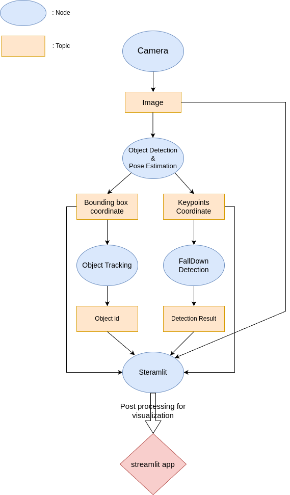

# ROS2 AI Pipeline

### SKHU AI Project: CCTV-Based Real-Time Monitoring Dashboard for Worker Safety
This project focuses on real-time monitoring of workers' safety using CCTV-based AI. We implemented various tasks, including pose estimation, multi-object tracking, data collection and preprocessing, and the training and evaluation of machine learning/deep learning models.

To integrate these components efficiently, we used ROS2 (Robot Operating System 2). 
We broke down this complex system into many modular nodes.
Also, leveraging ROS2’s excellent parallel processing capabilities, we designed the system to execute each component concurrently, ensuring real-time performance.


## ROS2 Pipeline


Each task is implemented as an independent ROS2 node that publishes and subscribes to data through topics. This minimizes dependencies between components, reducing the impact of errors or delays from other nodes.

Below is an overview of the nodes in our pipeline:

### Camera
Publish image from local camera. 

`publish`
- `camera/image_raw`

`parameters`
- `frame_rate`: Adjust publishing rate for a second. (default : 30)
- `camera_id` : Set local camera id. (default : 0)
---
### Detector
Subscribes to image data from the camera and predicts bounding boxes and keypoints.

`subscribe`
- `camera/image_raw`

`publish`
- `detector/bboxes`
- `detector/keypoints`

`parameters`
- `selection_criteria` : Set how to determine objects for keypoint extraction
- `threshold` : Set detection confidence score threshold. `float : 0~1`

More details on [dev-pose-estimation](https://github.com/SKHU-AI-2024-WINTER/dev-pose-estimation)

---
### Tracker
Subscribes to bounding boxes from the detector (optionally subscribes to camera images when using DeepSORT), performs multi-object tracking, and publishes tracking results.

`subscribe`
- `detector/bboxes`
- `camera/image_raw` (option)

`publish`
- `tracker/tracked_objects`

`parameter`
- `tracker_type` : 'sort', 'deepsort' or 'byte'

More details on [dev-tracking](https://github.com/SKHU-AI-2024-WINTER/dev-tracking)

---
### FallDetector
Performs Fall Detection based on keypoints.

`subscribe`
  - `detector/keypoints`

`publish`
  - `falldetector/falldets`

More details on [dev-fall-detection](https://github.com/SKHU-AI-2024-WINTER/dev-fall-detection)

---
### Streamlit
For Streamlit dashboard, streamlit node subscribe to every topics for visualization and aggregation.

`subscribe`
- `camera/image_raw`
- `detector/bboxes`
- `detector/keypoints`
- `tracker/tracked_objects`
- `falldetector/falldets`

To ensure seamless visualization and user experience, we implemented data synchronization using ROS2's `ApproximateTimeSynchronizer`.
```python
sync = message_filters.ApproximateTimeSynchronizer(
    [image_sub, bbox_sub, keypoints_sub, tracked_sub, fall_sub],
    queue_size=10, slop=0.5
)
sync.registerCallback(self.synced_callback)

```
By using `ApproximateTimeSynchronizer`, the Streamlit node can process data from the closest time frames simultaneously.
Received messages are transformed into Python data types that can be processed in the Streamlit main code.

Additionally, to display working status of each node in the dashboard, we used `services` between Streamlit node and each node. Streamlit node sends a request every second to other nodes. If Streamlit node gets response, working status of the node that sent the response will be set to 'working'. Else, the status will be 'error'.


## Dashboard
Using streamlit to visualize streaming and use some utilities.


### Component in this Dashboard

#### Extraction bounding box and visualize with expand 
1. Save first-generated bounding box as roi
2. Resize roi to adjust under main-streaming monitor as resized_roi
3. Set resized_streamlit_image at col3: image_placeholder_col3

#### Split section about fall-detection dashboard
1. Split with coulmn has referenced with some references
2. Use funtion st.colums of Streamlit

#### Fall-detection popup
1. To make this pop-up, set placeholder to under main-streaming image_placeholder
2. Insert pop-up status into fall_status code

```python
  if det > 0.5:
    fall_status = "Fall Detected"
    color = (255, 0, 255)  # Red for Fall Detected                    
    log_placeholder_2.write("Fall Detected")                     
    popup_placeholder.warning("FALL DETECTED!", icon="⚠️")                    
                        
  else:
    fall_status = "Normal"                    
    color = (0, 255, 0)  # Green for Normal                    
    log_placeholder_2.write("Normal")                    
    popup_placeholder.empty()                    
```
#### Visualize each nodes' activion status
1. Definition 'get_status_icon' to use icon
2. Set each nodes' icon, color to apply markdown 

### References

- Agricultural Drone Surveillance System User Interface : https://dribbble.com/shots/22484885-Agricultural-Drone-Surveillance-System-User-Interface
- Home Security Web App for Security Cameras Control : https://dribbble.com/shots/24698122-Home-Security-Web-App-for-Security-Cameras-Control

## Installation

See [installation instructions](assets/docs/INSTALL.md).
